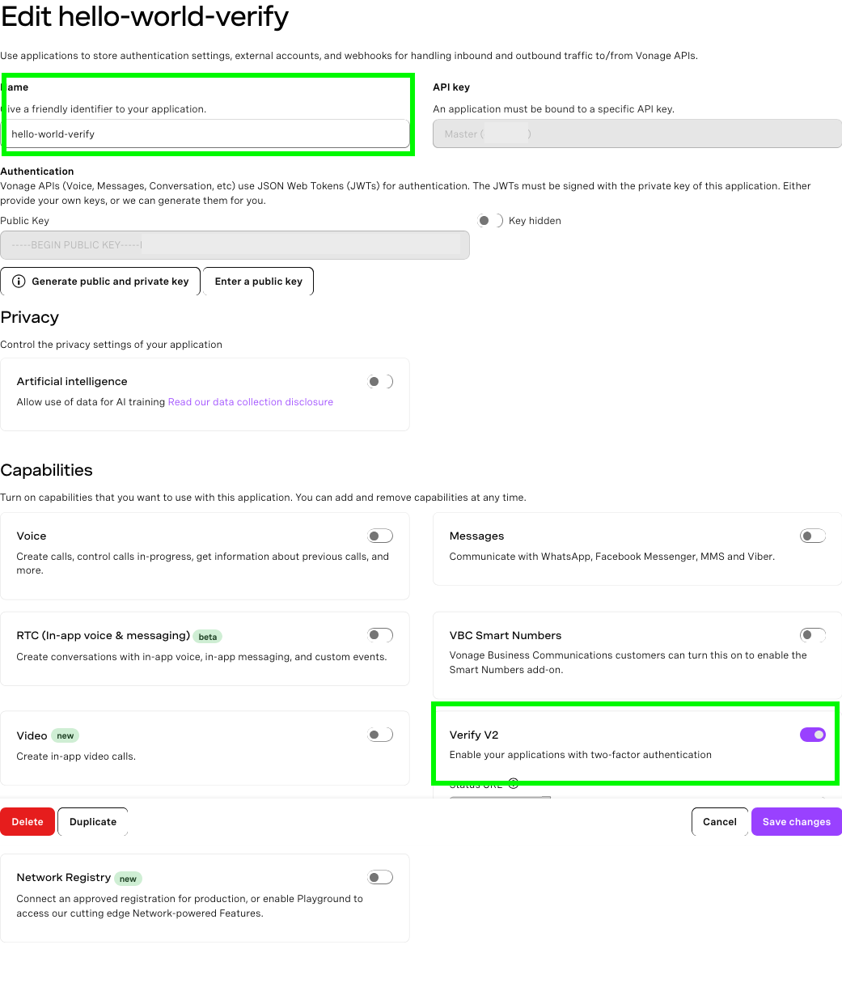
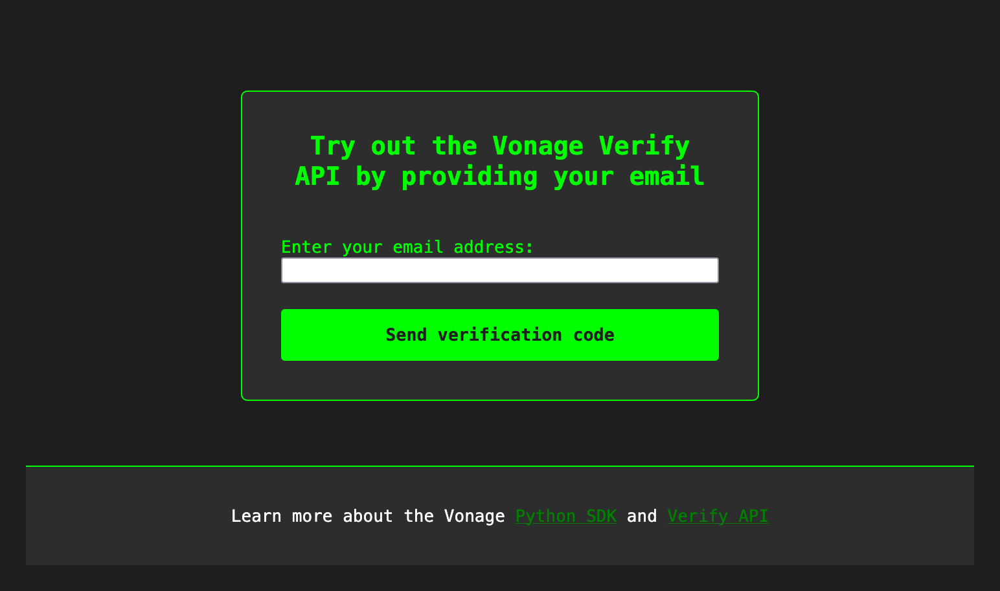
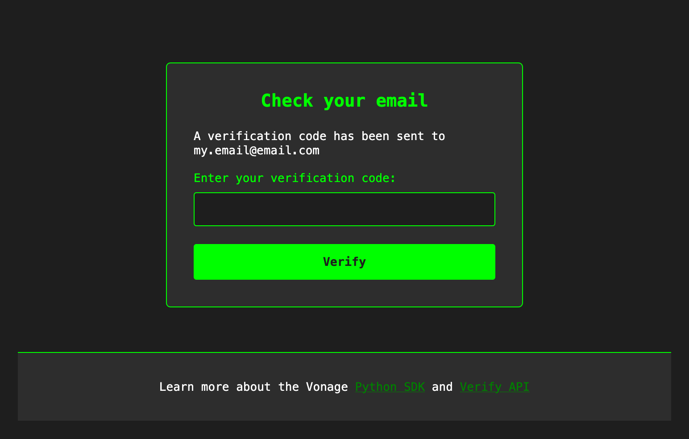

# Email Verification Web App With FastAPI and Vonage

A minimal web application built with FastAPI and the [Vonage Verify API](https://vonage.dev/4nYXkCu). Users can request a OTP password code sent to their email address. Upon entering the correct code into the app, users are rewarded with an animated gif.

## Features

- **OTP Code Generation**: Generate a OTP code
- **OTP Code Email Delivery**: Use email to receive a OTP code
- **Verification**: Verify that the code provided by the user matches the code generated by Vonage

# How To Get This Code Running

## Prerequisites
- Python 3.8+
- A [Vonage API account](https://vonage.dev/4dtSoCc)

## Setup

### 1. Create a Vonage account

You will need a [Vonage API account](https://vonage.dev/4dtSoCc) -- it's free to sign up!

### 2. Create a Verify application

Create your Verify application in the [developer dashboard](https://dashboard.vonage.com/applications) by navigating to the **Applications** window from the left hand menu and clicking the “Create new application” button. This will open the application creation menu. Give your application a human-friendly name like `vonage-hello-world`.

Under the **Capabilities** section, toggle the option for **Verify**.

Click the “Generate new application” button.



## Run the code

### 1. Create and activate a Python virtual environment

```
virtuanlenv venv && source venv/bin/activate
```
### 2. Install dependencies
```
pip install -r requirements.txt
```
### 3. Obtain your Vonage secrets

In the developer dashboard [Applications menu](https://dashboard.vonage.com/applications), click on your application and then click **Edit**. Once the edit window opens, click on the button that says, “Generate public and private key”. This will trigger a download of your private key as a file with the extension `.key`. **Keep this file private and do not share it anywhere it could be compromised.**

Click on the "Save changes button" and also note your Application ID.


### 4. Configure your environment variables

Move your private key file to your project directory and configure the variables in the `.env_template` file accordingly:

| Variable name           | Variable value                                                                              |
|-------------------------|---------------------------------------------------------------------------------------------|
| VONAGE_APPLICATION_ID   | This is the Vonage-generated ID of the Voice application you created for this sample code   |
| VONAGE_PRIVATE_KEY_PATH | This is the path to the **private.key** file you downloaded from the developer dashboard    |

Then update the name of the file from `.env_template` to `.env`.

### 5. Run the app

To spin up the app, run the following:

`fastapi dev`

### 6. Try it out!

In your browser, navigate to `http://127.0.0.1:8000`. You should see a webpage inviting you to "Try out the Vonage Verify
API by providing your email" with a text field for your email address.



You should be redirected to a page that asks you to provide the code sent to your email. Check your email for a OTP code from `verify[at]vonage.com` and enter this code.



If the code provided matches the code generated and sent by Vonage, then you'll be redirected to another page featuring an animated gif.

## Running the tests

This repo also provides a demonstration comparing the use of Pydantic to create and validate a Verify API request vs. manually creating the request.

**Please note** that these tests don't use any mocks, so you will be making real API calls which may incur costs.

### 1. Run the tests

Run the tests with the following command:

```
python -m unittest -v
```

Running the tests should produce the following outcome:

```
test_with_pydantic (tests.test_main.TestMain.test_with_pydantic) ... ERROR
test_without_pydantic (tests.test_main.TestMain.test_without_pydantic) ... FAIL
```

What's important to note here is that the test using Pydantic _errors out_ as opposed to _failing_. This is because Pydantic catches the incorrect request body parameters when the `VerifyRequest` object is created:

```
pydantic_core._pydantic_core.ValidationError: 1 validation error for EmailChannel
to
  Input should be a valid string [type=string_type, input_value=678910, input_type=int]
    For further information visit https://errors.pydantic.dev/2.13/v/string_type
```

The test without Pydantic _fails_ because the result is a `422` and not a `202` which is the [API response for invalid parameters](https://developer.vonage.com/en/api/verify.v2?source=verify#newRequest-responses):

```
AssertionError: 422 != 202 : Test without Pydantic failed with: 422. Expected: 202
```

## References

- [A Comprehensive Guide on Working with Python Virtual Environments](https://vonage.dev/42D6eeT)
- [Vonage Verify API for Developers](https://vonage.dev/4nYXkCu)
